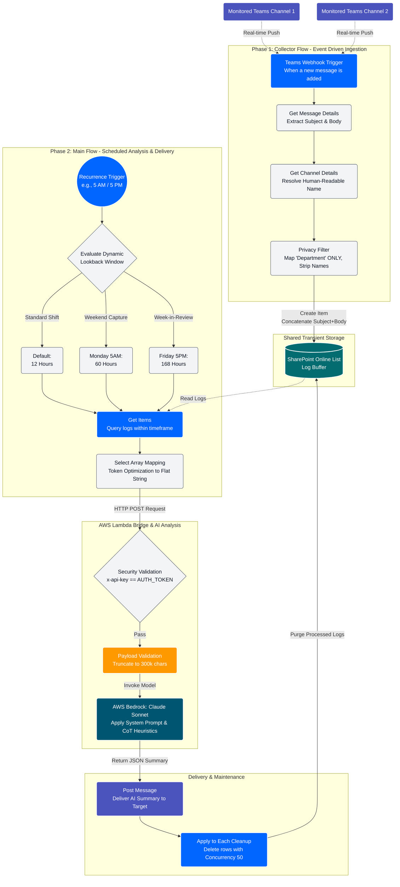

# AI Chat Monitor and Reporting Intelligence Engine

> A reusable, domain-agnostic framework that turns any Microsoft Teams conversation into structured, AI-generated intelligence, delivered automatically to the right people at the right time.

---

## The Problem This Solves

Organizations run on chat. Decisions get made, problems get diagnosed, complaints get surfaced, workarounds get invented, and almost all of it evaporates. What makes it into a ticket, a runbook, or a leadership report is a fraction of what was actually said.

This framework captures the rest.

Point it at any Teams channels, configure a prompt for the kind of intelligence you want to extract, and it will deliver a structured AI summary to your specified audience on a schedule you define. The underlying pipeline - ingest, analyze, deliver - is identical regardless of domain. What changes is which channels you listen to, what you ask the AI to look for, and who receives the output.

---

## How It Works

The system is built from two Power Automate flows backed by AWS Bedrock.

**Flow 1 - Collector (`code_collector.json`)**

An event-driven webhook listener that fires the moment a new message is posted to any monitored channel. It extracts the message content, resolves the channel name, and writes an anonymised record to a SharePoint list acting as a rolling buffer. No PII enters the pipeline - the sender's department is captured rather than their display name.

You deploy one collector per logical channel group. All collectors write to the same shared SharePoint buffer, so the analysis layer has a unified view regardless of how many source channels you monitor.

**Flow 2 - Analyzer + Delivery (`code_main_flow.json`)**

A scheduled flow that runs on a configurable cadence. It queries the SharePoint buffer for the relevant time window, flattens the records into a token-optimised plain-text string, and sends the payload to AWS Bedrock via a Lambda bridge. Claude Sonnet processes the logs with a Chain-of-Thought prompt tuned to your domain's specific intelligence targets. The resulting summary is posted to a Teams channel or direct message, and the processed records are purged from the buffer.

---

## Architecture



---

## Example Deployments

The three examples below are included as reference configurations. They are not exhaustive - this framework has been deployed for HR pulse-checks, project management digests, customer feedback monitoring, and security operations, among others. Any environment where high-value context is being discussed in Teams channels and not making it into formal reporting is a candidate.

### Major Incident Management (MIM)

| | |
|---|---|
| **Source channels** | Dedicated MIM / incident war-room channels |
| **AI focus** | Tribal knowledge (undocumented fixes, workarounds), gap and risk identification, complaint escalation signals |
| **Cadence** | 12-hour standard, 60-hour Monday morning (captures weekend), 168-hour Friday evening (full week-in-review) |
| **Audience** | On-coming shift engineers, weekly leadership digest |

The MIM deployment pioneered the intelligent lookback logic. Without the expanded Monday and Friday windows, weekend discoveries and full-week strategic patterns fall outside the analysis window entirely.

### Day-to-Day Operations

| | |
|---|---|
| **Source channels** | All internal operational channels - network, database, deployment, infrastructure, platform |
| **AI focus** | Process friction, recurring blockers, informal decisions, knowledge shared between teams that never reaches documentation |
| **Cadence** | Daily digest, timed to arrive before the morning standup |
| **Audience** | All teams and managers, posted to a shared main channel |

The ops deployment is the broadest in scope. It replaces the need for teams to manually write daily standups from memory, and surfaces cross-team patterns that no single team has full visibility into.

### Business Intelligence

| | |
|---|---|
| **Source channels** | Leadership, planning, strategy, and cross-functional coordination channels |
| **AI focus** | KPIs and targets mentioned in conversation, customer feedback signals, strategic decisions and their rationale, emerging risks |
| **Cadence** | Weekly, with on-demand capability for time-sensitive periods |
| **Audience** | Executives, directors, and senior leadership |

The BI deployment exists because leadership is not reading every channel. Critical complaints, architectural risks, and strategic misalignments that surface in conversation but never get escalated formally are captured here and presented in a digestible digest. This is gap analysis and risk visibility at the organisational level.

---

## Repository Structure

```
/
├── README.md                         ← This file
├── flows/
│   ├── code_collector.json           ← Real-time ingest: Teams → SharePoint
│   ├── code_main_flow.json           ← Analysis + delivery engine
│   ├── README_Collector.md           ← Collector deployment guide
│   └── README_Main_Flow.md           ← Main flow deployment guide
└── aws-lambda-processor/
    └── README.md                     ← Lambda bridge and Bedrock prompt guide
```

---

## Configuring for a New Domain

Deploying this framework for a new domain requires changes in four places only.

**1. Collector flow - source channels**

Update the trigger to include your target Teams Group ID and Channel IDs. If you are monitoring high-volume channels, deploy a separate collector instance per logical group rather than loading all channels into a single flow. See `flows/README_Collector.md` for the scaling rationale.

**2. SharePoint list**

The buffer list schema is fixed - `Title`, `MessageBody`, `OriginalTimestamp`, `ChatID`. No changes needed regardless of domain.

**3. Main flow - schedule and lookback logic**

Set the recurrence trigger to the cadence appropriate for your domain. Update the `varLookbackHours` default and any conditional overrides to match your reporting windows (12h, 24h, weekly, etc.).

**4. Lambda prompt - AI focus**

This is the only substantive domain-specific change. The prompt sent to Claude Sonnet via the Lambda bridge defines what the model looks for, how it structures the output, and who the summary is written for. The Chain-of-Thought structure should specify: what signals to extract, what to ignore, how to categorise findings, and the tone appropriate for your audience. See `aws-lambda-processor/README.md` for prompt engineering guidance and example templates for each included domain.

---

## Intelligent Lookback Logic

The `code_main_flow.json` uses `dayOfWeek()` and `formatDateTime()` to dynamically evaluate the current day and time before querying the buffer. The default lookback is 12 hours. Two conditional overrides expand the window:

- **Monday 5 AM → 60 hours**: Captures all weekend activity. Without this, Friday-evening-through-Monday-morning conversations fall outside the analysis window permanently.
- **Friday 5 PM → 168 hours**: Generates a full week-in-review. Configurable to any day/time combination appropriate for your reporting cycle.

These values are set in a single integer variable (`varLookbackHours`) and are straightforward to adjust for any domain's cadence requirements.

---

## Performance and Scale

**Token efficiency**

The `Select` action in the main flow uses Text Mode mapping rather than standard Key-Value output. This strips JSON syntax from the array before it reaches the LLM, reducing token consumption meaningfully at high log volumes. The format produced is: `[ChannelName] [Timestamp] Department: MessageBody` - one log entry per line, human-readable, no structural overhead.

**SharePoint throughput**

The cleanup loop runs with a concurrency of 50 parallel delete operations. This is the practical upper bound before SharePoint throttling becomes a factor. Do not increase this value without testing against your tenant's throttling thresholds.

**Collector scaling**

A single collector flow can monitor multiple channels, but at high message volumes it will hit Power Automate concurrency limits, most commonly producing duplicate buffer entries. Duplicate entries inflate token costs and introduce noise into AI output. The safe pattern is one collector per logical channel group, all writing to the same shared buffer.

---

## Security

- The Lambda function is authenticated via a shared secret in the `x-mim-secret` request header. Store this value in an Azure Key Vault reference or a secure environment variable - never hardcoded in the flow definition.
- The SharePoint buffer is transient. Records are deleted after each analysis run. No raw chat content is retained beyond the active lookback window.
- All exported `.zip` solution packages in `/deploy` have connection references sanitised. You will be prompted to re-authenticate your Teams and SharePoint connections on import.
- The collector is designed to extract `department` rather than `displayName`. This keeps PII out of the buffer, the LLM prompt, and the summary output. Do not change this without a formal PII assessment for your jurisdiction.

---

## Deployment

Full step-by-step instructions are in each flow's own README. The high-level sequence is:

1. Deploy the SharePoint buffer list using the schema in `flows/README_Collector.md`
2. Deploy the AWS Lambda bridge and configure your Bedrock prompt (see `aws-lambda-processor/README.md`)
3. Import and configure `code_collector.json` - one instance per channel group
4. Import and configure `code_main_flow.json` - one instance per domain or audience
5. Run an end-to-end test by posting to a monitored channel and triggering the main flow manually

---

## Extending the Framework

This system is intentionally unopinionated about domain. Teams channels are the input interface and Teams messages are the default output - but the delivery step can be adapted to post to SharePoint pages, send emails, write to a database, or trigger a webhook to any downstream system. The Lambda bridge makes the AI processing layer similarly portable: swap Bedrock for any LLM API without touching the Power Automate layer.

Pull requests are welcome for new prompt templates, delivery adapters, and additional lookback logic patterns. Open an issue first to discuss significant architectural changes.

---

## License

[MIT](LICENSE)
